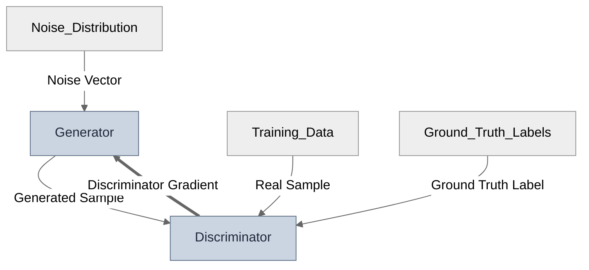
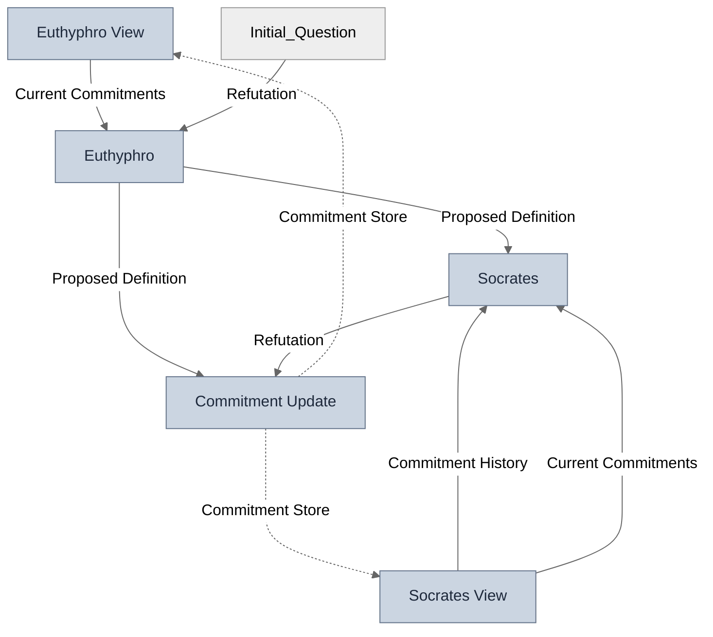
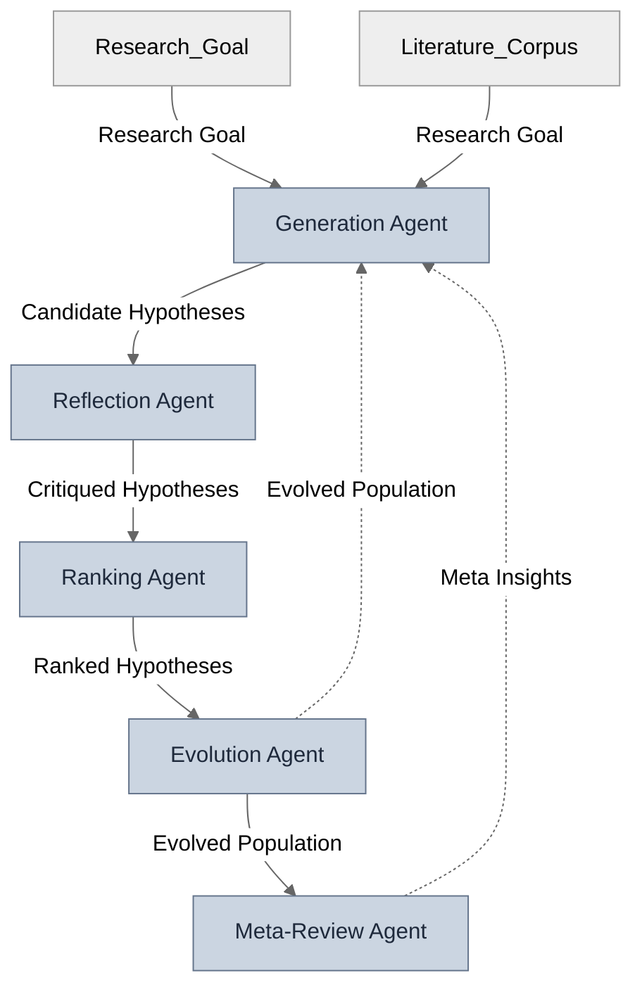

# Structural Comparison: Three Instances of Antagonism

*A formal analysis of GANs, Socratic elenchus, and AI Co-Scientist as compositional games*

---

## 1. The Claim

There is a recurring architectural pattern across adversarial systems: a generative process and an evaluative process, operating under different objectives, coupled into a feedback loop. The quality improvement comes not from either component alone but from the tension at their interface.

This paper encodes three instances of this pattern in the Open Games formalism (Ghani, Hedges et al. 2018) using the GDS-Core framework (Zargham & Shorish 2022), compiles them to a common intermediate representation, and compares their topological properties via SPARQL on a merged RDF graph. The structural comparison reveals that these systems are **not** topologically equivalent — they use different composition operators with different convergence dynamics and different failure modes.

The result is a **taxonomy of antagonistic systems** classified along three axes: operator class, observation symmetry, and commitment enforcement.

---

## 2. The Three Systems

### 2.1 Generative Adversarial Network (Goodfellow 2014)

Two neural networks — a Generator and a Discriminator — locked in a minimax game. The Generator produces samples from noise; the Discriminator classifies samples as real or generated. The Discriminator's gradient signal feeds back to the Generator within the same training step.

**GDS encoding:** Two `DecisionGame` blocks composed with `FeedbackLoop` (contravariant, within-timestep).

Solid arrows = covariant (forward) flow. Double-line arrows = contravariant (feedback) flow. *Generated by gds-viz.*

**Structural facts:**
- 2 blocks (both `decision` type)
- 1 feedback wiring (Discriminator Gradient, contravariant)
- 0 temporal wirings
- Covariant flow graph is acyclic
- Verification: 26/27 OGS checks passed, 11/11 GDS checks passed (S-005 warning: environment-sourced utility)

### 2.2 Socratic Elenchus — the Euthyphro (Plato, c. 399 BCE)

A structured dialogue where Socrates (the questioner) systematically extracts commitments from Euthyphro (the respondent) until the commitment store becomes circular. Five definitions of piety are proposed and refuted. The dialogue terminates in aporia — Definition 5 reduces to Definition 3, which was already refuted.

**GDS encoding:** Two `DecisionGame` blocks (Euthyphro, Socrates) with asymmetric observation projections, a `CovariantFunction` (Commitment Update) as world-state mechanism, composed with `CorecursiveLoop` (covariant, cross-timestep).

Solid arrows = covariant flow. Dotted arrows = temporal (cross-timestep) wirings. *Generated by gds-viz.*

The commitment store accumulates across turns — each turn adds a definition and a refutation. The loop terminates when the store trajectory enters a cycle.

**Key structural feature: asymmetric observation.** Socrates' `x` channel (Commitment History + Current Commitments + Proposed Definition) is a strict superset of Euthyphro's `x` channel (Current Commitments + Refutation). This asymmetry is implemented via projection blocks (`Euthyphro View`, `Socrates View`) that receive the same state variable but project it differently.

**Structural facts:**
- 5 blocks (2 `decision`, 3 `function_covariant`)
- 0 feedback wirings
- 2 temporal wirings (Commitment Store → Euthyphro View, Commitment Store → Socrates View)
- Verification: 29/29 OGS checks passed, all GDS checks passed

### 2.3 AI Co-Scientist (Gottweis et al. 2025)

A hierarchical multi-agent system where specialized agents — Generation, Reflection, Ranking, Evolution — process hypotheses in an inner pipeline. A Meta-Review agent closes an outer loop, reasoning about the *distribution* of inner-loop outcomes across research rounds.

**GDS encoding:** Four agents in a sequential inner pipeline composed with `CorecursiveLoop` (inner temporal loop: evolved population feeds back to generation). The Meta-Review agent closes a second `CorecursiveLoop` (outer temporal loop: meta-insights feed back to generation across rounds).

Dotted arrows = temporal wirings. *Generated by gds-viz.*

The inner loop (Evolution → Generation) iterates hypotheses within a round. The outer loop (Meta-Review → Generation) accumulates strategic insights across rounds.

**Structural facts:**
- 5 blocks (3 `decision`, 2 `function_covariant`)
- 0 feedback wirings
- 2 temporal wirings (inner: Evolved Population → Generation, outer: Meta Insights → Generation)
- Verification: 24/24 OGS checks passed, all GDS checks passed

---

## 3. The Comparison

All three models were compiled to `SystemIR`, exported to RDF via `gds-owl`, merged into a single graph, and queried with SPARQL.

### 3.1 Operator Class

The primary taxonomic discriminant is whether the system uses feedback (contravariant, within-timestep) or temporal/corecursive (covariant, cross-timestep) wirings.

| System | Feedback wirings | Temporal wirings | Operator class |
|--------|:---:|:---:|---|
| GAN | 1 | 0 | `FeedbackLoop` — symmetric antagonism |
| Euthyphro | 0 | 2 | `CorecursiveLoop` — pursuit-evasion |
| Co-Scientist | 0 | 2 | `CorecursiveLoop` nested — hierarchical |

The three systems compile to **structurally distinct composition trees**. GANs use within-timestep feedback; elenchus and co-scientist use cross-timestep iteration. The distinction between elenchus (single temporal loop) and co-scientist (nested temporal loops) is visible in the wiring targets: both temporal wirings in elenchus point to the same destination (commitment store → two view projections), while the co-scientist's two temporal wirings serve different functions (inner loop iterates hypotheses, outer loop accumulates meta-insights).

### 3.2 Observation Symmetry

Queried via SPARQL on the `signatureForwardIn` field of `decision`-type blocks.

| System | Player 1 | Player 2 | Symmetric? |
|--------|----------|----------|:---:|
| GAN | Generator: `Noise Vector` | Discriminator: `Generated Sample + Real Sample` | Comparable |
| Euthyphro | Euthyphro: `Current Commitments + Refutation` | Socrates: `Commitment History + Current Commitments + Proposed Definition` | **Asymmetric** |
| Co-Scientist | Generation: `Research Goal + Meta Insights` | Ranking: `Critiqued Hypotheses` | Hierarchical |

In the GAN, both players observe comparable signals — the asymmetry is in the signal content (noise vs samples), not in the observation structure. In the elenchus, Socrates observes a strict superset: the full commitment history plus the current proposal. Euthyphro sees only the current commitment state plus the latest refutation. This asymmetry is **structurally encoded** in the wiring topology via projection blocks and is queryable in SPARQL.

### 3.3 Commitment Enforcement

The third axis — whether the state update mechanism is monotonic (append-only) — is not directly capturable in the GDS composition algebra, because it is a property of the mechanism's update rule, not its topology. However, the presence or absence of a dedicated state-update block is structurally visible:

| System | State update block | Monotonicity |
|--------|---|---|
| GAN | None (parameters update in-place) | N/A — no accumulating store |
| Euthyphro | `Commitment Update` (CovariantFunction) | **Enforced** — append-only by design |
| Co-Scientist | `Evolution Agent` (CovariantFunction) | Partial — selection + variation, not append-only |

In the elenchus, the commitment store is world-state owned by the Dialogue entity. New commitments are added; refuted definitions are marked but not deleted. This monotonicity is what prevents sophistry — the evader cannot retract prior concessions.

---

## 4. The Taxonomy

The three axes — operator class, observation symmetry, and commitment enforcement — jointly determine the convergence dynamics and failure modes.

| Class | Operator | Observation | Enforcement | Convergence | Failure mode |
|-------|----------|-------------|-------------|-------------|-------------|
| **Symmetric** | `FeedbackLoop` | Comparable | N/A | Nash equilibrium | Mode collapse |
| **Pursuit-evasion** | `CorecursiveLoop` | Asymmetric | Monotonic | Circularity (aporia) | Sophistry |
| **Hierarchical** | Nested `CorecursiveLoop` | Hierarchical | Partial | Elo stability | Sycophantic consensus |

**Mode collapse** occurs when the evaluator and generator share the same information channel — the feedback signal loses orthogonality. This is a failure of observation symmetry: the discriminator has no independent leverage on truth.

**Sophistry** occurs when the commitment store grows without bound without entering a cycle — the evader escapes by shifting ground faster than the pursuer can close contradictions. This is a failure of commitment enforcement: the monotonicity constraint is violated (retractions allowed) or the evader's strategy space is too large to navigate.

**Sycophantic consensus** occurs when inner-loop agents converge on locally popular answers because the outer meta-review signal is too weak. This is a failure of hierarchical observation: the outer loop has insufficient leverage over the inner loop's reward structure.

The failure modes are **associated with** the three-axis combination, not predicted by operator class alone. Operator class creates the structural precondition; observation symmetry determines whether the evaluator has independent leverage; enforcement determines whether the loop converges or cycles.

---

## 5. The Euthyphro Annotation

The elenchus model is grounded in a detailed commitment-store annotation of the Euthyphro dialogue. The annotation uses a five-type taxonomy:

| Type | Count | Write condition |
|------|:---:|---|
| Commitment | 28 | Ratified under Socratic questioning |
| Assertion | 4 | Volunteered without being bound |
| Presupposition | 2 | Implicit, available for exploitation |
| Derivation | 6 | Reasoned from premises in store, monologue + silence |
| Conditional commitment | 0 | If/then ratified as a unit (none found in this dialogue) |

**Key finding:** The `conditional_commitment` type has zero instances in the Euthyphro. Every passage that appears conditional on the surface is actually a derivation from independently conceded premises. The LLM's initial classification of Section 9 (gods-disagree argument) as a conditional commitment was scholarly contamination — the text presents it as a step-by-step extraction chain.

**The asymmetry is quantified:**
- Euthyphro's store: 0 → 25 entries (22 commitments + 1 assertion + 2 presuppositions)
- Socrates' store: 0 entries throughout
- Dialogue world-state: 6 derivation records

Socrates contributes nothing to his own commitment store but performs all 6 derivations. He is a pure evaluator — extracting commitments from Euthyphro and reasoning about the accumulated store without adding to it.

**The cycle closes mechanically:** D5 (sacrifice and prayer) → C-16.4 (gifts = what pleases the gods) → C-16.5 (piety = what is dear to the gods) → Socrates equates "dear" with "loved" at T226 → D3 (what all the gods love) → D-12.1 (holy ≠ god-loved via substitution contradiction). The closing derivation (D-12.1) is `available_to: socrates_only` from Section 12 through Section 17, transitioning to `available_to: both` at T225 when Euthyphro says "I quite remember."

---

## 6. Known Limitations

**Terminal conditions are strings, not computable predicates.** GDS `CorecursiveLoop.exit_condition` accepts free-form text. The convergence claims (Nash equilibrium, aporia, Elo stability) are external to the formalism. The taxonomy classifies structural preconditions for convergence, not convergence itself.

**Information content is not capturable.** The composition algebra captures *that* feedback exists and *who observes what*, but not *whether* the evaluator's information is orthogonal to the generator's model. The orthogonality condition — the key to productive versus degenerative antagonism — remains partially semantic, partially structural.

**The Euthyphro dilemma's interpretation is contested.** Our D-12.1 derivation uses interpretation-neutral language (substitution contradiction), but the scholarly literature divides on whether the argument demonstrates explanatory priority (Sharvy 1972, Judson 2010) or strict non-identity (Ebrey 2017). Both readings produce the same structural result. See `references/ebrey_2017_identity_and_explanation.pdf`.

**S-005 false positive.** The GAN's Discriminator receives its utility signal (Ground Truth Labels) from the environment, not from another player. OGS check S-005 produces a warning for this topology because it expects intra-game contravariant flow.

---

## 7. What the Taxonomy Predicts

For any new system that can be encoded in GDS/OGS, the taxonomy makes the following testable predictions:

1. **Identify the operator class** — does the system use `FeedbackLoop`, `CorecursiveLoop`, or nested loops? This determines whether state accumulates across steps.

2. **Check observation symmetry** — do the players' `x` channels observe comparable signals, or does one observe a strict superset? This determines whether the evaluator has independent leverage.

3. **Check commitment enforcement** — is the state update mechanism monotonic? This determines whether the loop can cycle.

4. **Predict the failure mode** from the three-axis combination:
   - `FeedbackLoop` + symmetric → mode collapse risk
   - `CorecursiveLoop` + asymmetric + monotonic → convergence (productive elenchus)
   - `CorecursiveLoop` + asymmetric + non-monotonic → sophistry risk
   - Nested `CorecursiveLoop` + weak outer signal → sycophantic consensus risk

These predictions are testable: encode a fourth system, classify it, and check whether the predicted failure mode matches the observed one.
